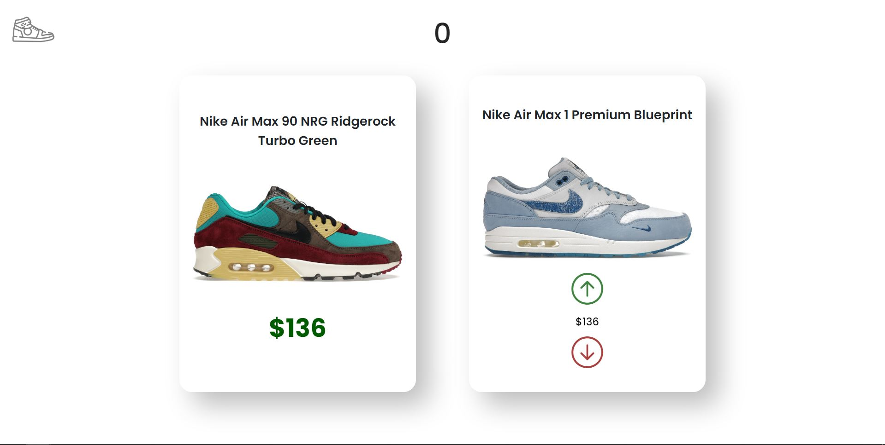
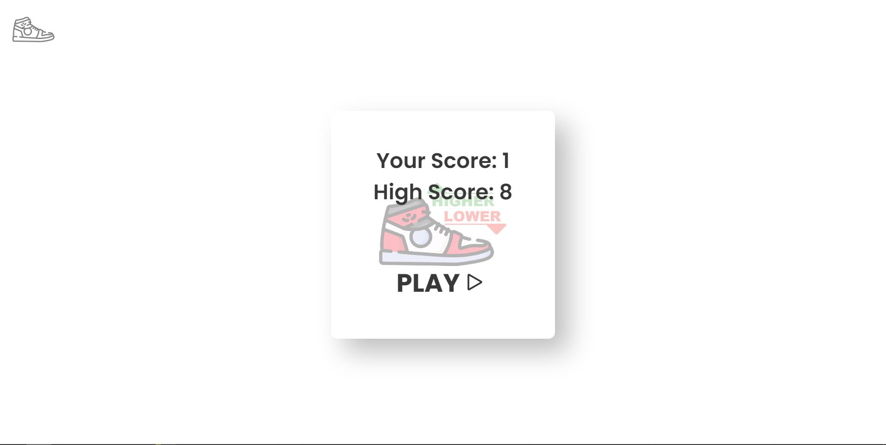

# Higher Lower Sneakers App

The [Higher Lower Sneakers App](https://higherlowersneakers.web.app/), created with React, is a way for sneaker-heads to test their knowledge of the current sneaker market. Given two different shoes, the user will have to determine which shoe is currently worth more on the sneaker market.

## Demo

## Screenshots

